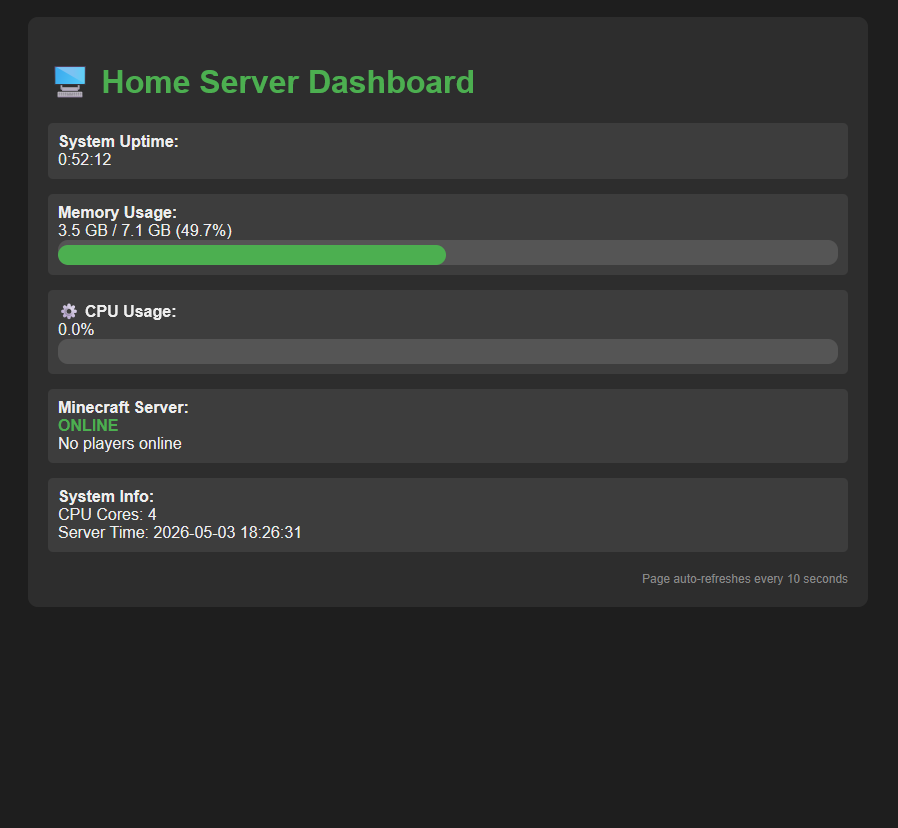
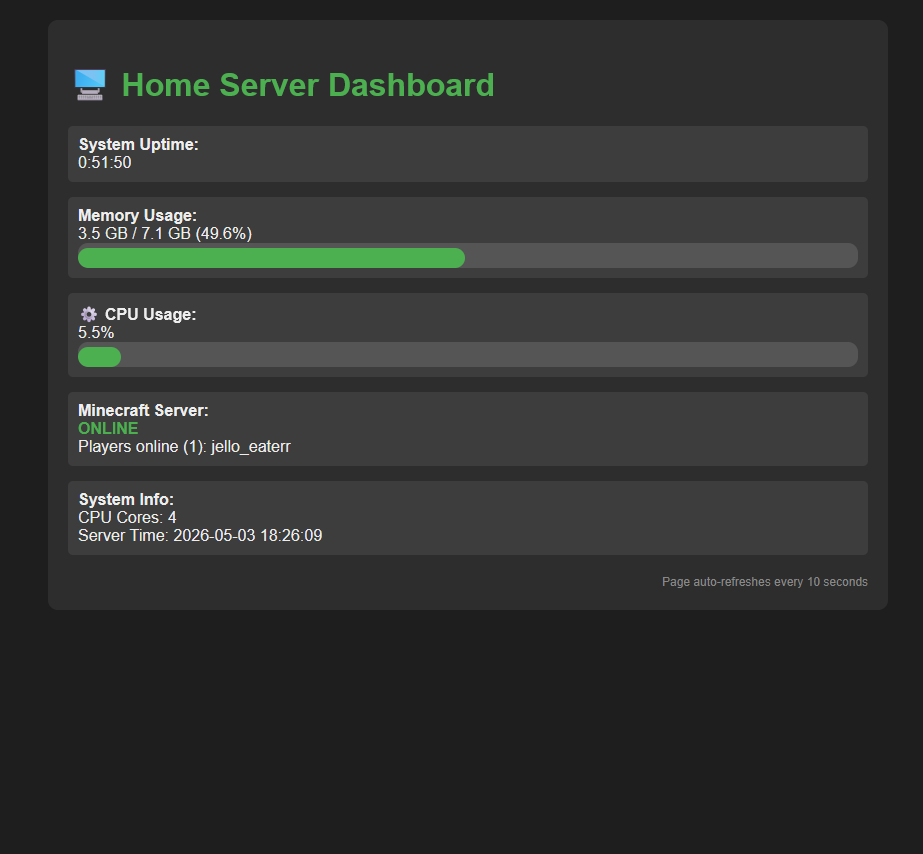

# Home Server Dashboard

A real-time monitoring dashboard for a headless Ubuntu home server running a Minecrafter server.

## Features
- Live CPU, RAM, and uptime monitoring
- Real-time Minecraft player tracking via RCON
- Auto-refreshing web interface
- DuckDNS dynamic DNS integration

## Tech-Stack
- Flask (Python web framework)
- psutil (system metrics)
- RCON protocol (Minecraft server query)
- Screen (process management)
- Cron (automation)

## Hardware
- 2015 Dell Laptop
- 8GB RAM
- 256GB HDD
- Intel i5-500U

## Setup Overview
1. Install Ubuntu Server
2. Configure statis IP via Netplan
3. Install Java and Minecraft server
4. Enable RCON in server.properties
5. Deploy Flash dashboard with virtual environment
6. Configure DuckDNS and cron
7. Set up port forwarding on router

## Key Challenges Solve
- WiFi connectivity on headless server (Netplan debugging)
- Keeping processes alive after SSH logout (screen)
- Dynamic DNS for chaning public IP (DuckDNS + cron)
- Real-time game server queries (RCON protocol)

## Usage

### Access Dashboard
http://your-server-ip:5000

### SSH into server
ssh username@server-ip

### Manage services
screen -r minecraft
screen -r dashboard

## Screenshots

*Empty Server:*

*Players Onlines:*
